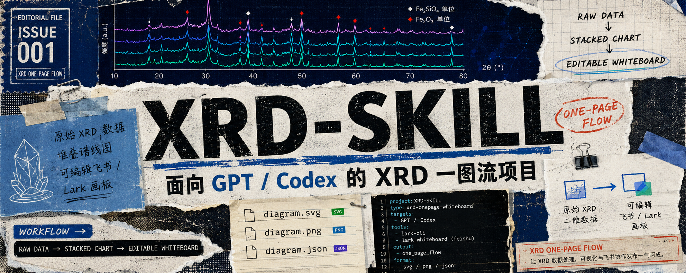
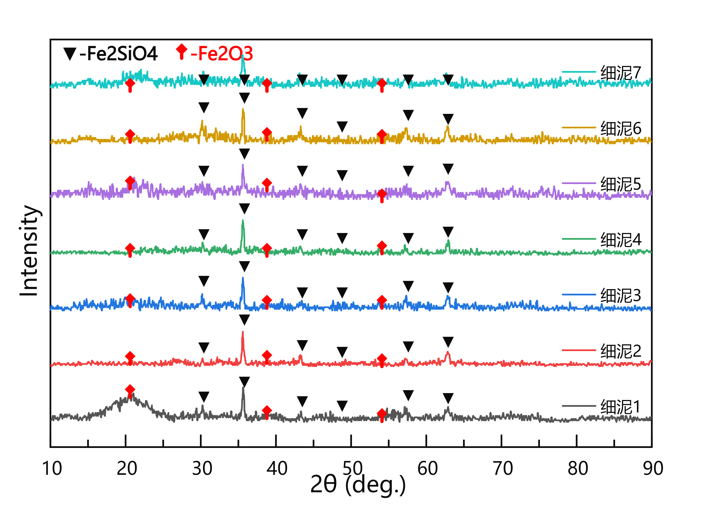
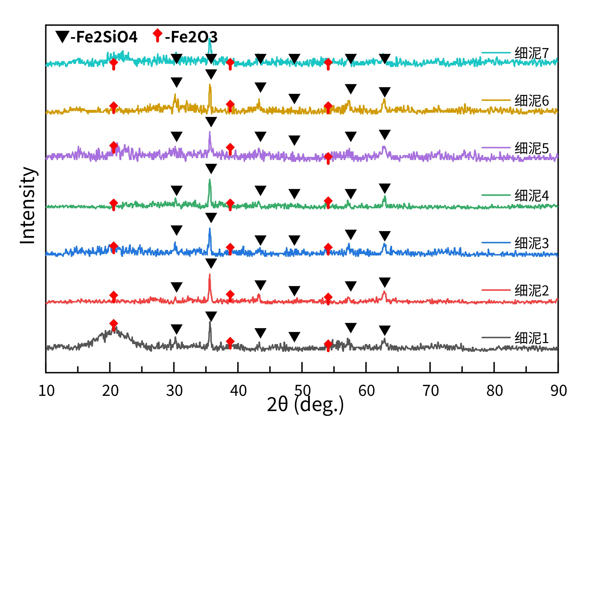

<div align="center">

# XRD-SKILL

从 XRD 原始数据到飞书可编辑画板的完整一图流工作流。


</div>

> ✅ **Verified:** 已验证可从示例 XRD 数据生成 `diagram.svg`、`diagram.png`、`diagram.json`，并成功发布为飞书可编辑画板。

<p align="center">
  
</p>

---

如果你通过 OpenClaw、QClaw、KimiClaw、JVSClaw、WorkBuddy、ArkClaw，或只通过 GitHub 获取本项目，请先阅读本 README 和 `docs/USAGE.md`。本项目已经内置示例数据、可运行脚本和安装检查入口，克隆后可以直接验证完整链路。

## 效果预览

| 本地生成的 XRD 图 | 飞书可编辑画板预览 |
| --- | --- |
|  |  |

在线飞书文档：[XRD 一图流画板](https://lucianaib.feishu.cn/wiki/FNfkwYYe4i033qkMgN8cYSOUnRf)

## 项目能做什么

XRD-SKILL 是一个面向 GPT / Codex 的 XRD 一图流项目。它把传统的手动作图流程拆成两项可复用技能：

1. **从原始数据生成 XRD 图**：读取二维 XRD 数据，自动绘制堆叠谱线图，并生成 SVG、PNG 和飞书画板 OpenAPI 节点文件。
2. **从 XRD 图生成飞书画板**：把 SVG 或 OpenAPI JSON 写入飞书 / Lark 画板，生成可继续编辑的节点，而不是不可编辑截图。

这套流程适合 XRD 汇报图、实验对比图、画板修复、以及把已有 XRD 图形沉淀成可重复执行的 GPT 项目。

## 项目结构

```text
XRD-SKILL/
├── skill/xrd-onepage-whiteboard/      # Codex Skill 包
│   ├── SKILL.md                       # Skill 触发说明和工作流
│   ├── agents/openai.yaml             # Codex/OpenAI Skill UI 元数据
│   └── scripts/
│       ├── xrd_data_to_chart.py       # XRD 原始数据 -> SVG/PNG/OpenAPI
│       └── publish_xrd_whiteboard.py  # SVG/OpenAPI -> 飞书画板
├── scripts/
│   ├── preflight.py                   # 环境与依赖检查
│   └── install_codex_skill.py         # 安装到本机 Codex skills 目录
├── examples/
│   ├── sample-data/                   # 示例 XRD txt 数据
│   ├── sample-output/                 # 示例生成图和飞书预览
│   ├── reference-xrd.tif              # 原始参考效果图
│   └── reference-xrd-preview.png      # 参考效果图预览
├── docs/
│   ├── USAGE.md                       # 详细使用说明
│   └── CUSTOM_GPT_SETUP.md            # GPT 项目/自定义 GPT 配置说明
├── GPT_INSTRUCTIONS.md                # 给 GPT 项目使用的指令
├── AGENTS.md                          # Agent 维护规则
└── README.md
```

## 环境要求

- Python 3.10 或更高版本；
- Node.js 20 或更高版本；
- 可通过 `npx` 调用 `@larksuite/whiteboard-cli`；
- 发布到飞书时，需要已安装并完成认证的 `lark-cli`。

只验证本地作图能力：

```powershell
python ".\scripts\preflight.py" --skip-lark
```

验证完整飞书发布能力：

```powershell
python ".\scripts\preflight.py"
```

## 快速开始

克隆仓库后进入项目目录：

```powershell
git clone git@github.com:LucianaiB2004/XRD-SKILL.git
cd XRD-SKILL
```

安装为本机 Codex Skill：

```powershell
python ".\scripts\install_codex_skill.py" --force
```

重启 Codex 后，可以直接这样调用：

```text
使用 $xrd-onepage-whiteboard，把 ./examples/sample-data 里的 XRD 数据生成一图流，并发布到这个飞书文档：<文档链接>
```

## 使用示例数据生成 XRD 图

```powershell
python ".\skill\xrd-onepage-whiteboard\scripts\xrd_data_to_chart.py" `
  --data-dir ".\examples\sample-data" `
  --output-dir ".\runs\sample" `
  --render --check --openapi
```

生成结果包括：

- `runs/sample/diagram.svg`：可转换为飞书画板节点的 SVG 源文件；
- `runs/sample/diagram.png`：本地渲染预览图；
- `runs/sample/diagram.json`：飞书 OpenAPI 画板节点；
- `runs/sample/metadata.json`：输入数据和输出文件记录。

## 发布到飞书画板

覆盖写入已有飞书画板：

```powershell
python ".\skill\xrd-onepage-whiteboard\scripts\publish_xrd_whiteboard.py" `
  --whiteboard-token "<WHITEBOARD_TOKEN>" `
  --openapi-json ".\runs\sample\diagram.json" `
  --preview-output ".\runs\sample\live"
```

追加一个新画板块到飞书文档或 Wiki 页面：

```powershell
python ".\skill\xrd-onepage-whiteboard\scripts\publish_xrd_whiteboard.py" `
  --doc "https://your-domain.feishu.cn/wiki/..." `
  --openapi-json ".\runs\sample\diagram.json" `
  --title "XRD 一图流画板" `
  --preview-output ".\runs\sample\live"
```

发布脚本会导出飞书端实时预览图，用于确认写入后的布局是否正确。

## 作为 GPT 项目使用

如果要包装成自定义 GPT 或 GPT 项目，建议把以下文件加入项目知识：

- `README.md`
- `GPT_INSTRUCTIONS.md`
- `docs/USAGE.md`
- `docs/CUSTOM_GPT_SETUP.md`
- `skill/xrd-onepage-whiteboard/SKILL.md`

运行环境中保留这两个脚本，供 GPT / Agent 调用：

- `skill/xrd-onepage-whiteboard/scripts/xrd_data_to_chart.py`
- `skill/xrd-onepage-whiteboard/scripts/publish_xrd_whiteboard.py`

## 验证清单

拿到本项目后，建议按顺序验证：

1. `python ".\scripts\preflight.py" --skip-lark`
2. `python ".\scripts\install_codex_skill.py" --force`
3. `python ".\skill\xrd-onepage-whiteboard\scripts\xrd_data_to_chart.py" --data-dir ".\examples\sample-data" --output-dir ".\runs\sample" --render --check --openapi`
4. 如果需要飞书发布，再运行 `python ".\scripts\preflight.py"` 并使用 `publish_xrd_whiteboard.py` 发布到目标文档或画板。

## 常用参数

默认文件匹配规则：

```text
XN*_Theta_2-Theta.txt
```

默认样品标签：

```text
XN1 -> 细泥1
XN2 -> 细泥2
...
```

可通过参数调整物相峰位：

```powershell
--black-peaks "30.2,35.6,43.3,48.6,57.4,62.7"
--red-peaks "20.6,38.8,54.1"
```

如果不需要物相标记：

```powershell
--no-markers
```

## 注意事项

- 默认只读取 `XN*_Theta_2-Theta.txt`，因此不会把 `tuonijingkuang` 参考样误放进图里。
- 如果换了数据集，应先确认文件名规则和峰位标记是否需要调整。
- `publish_xrd_whiteboard.py` 覆盖已有画板时会使用 overwrite 模式，适合恢复被误移动或误编辑的画板。
- 每次发布后都应查看飞书端导出的 `live.png`，因为本地检查不能覆盖所有视觉碰撞问题。

## 许可证

本项目使用 MIT License。详见 [LICENSE](LICENSE)。
